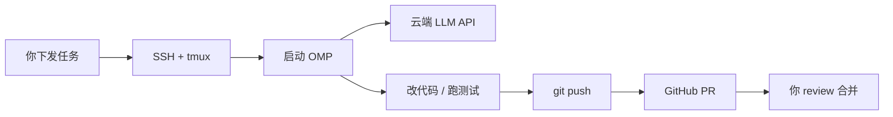

# 阿里云服务器部署 OMP Agent 完整指南

> 整理自 2026-07-30 讨论  
> 适用场景：在 2 核 2G 阿里云服务器上，通过 SSH 下发任务，让 OMP（Oh My Pi）自主完成代码工作并提交 GitHub PR。

---

## 目录

1. [背景与目标](#1-背景与目标)
2. [OMP 是什么](#2-omp-是什么)
3. [推荐架构](#3-推荐架构)
4. [服务器实测分析（39.105.56.91）](#4-服务器实测分析391055691)
5. [网络与代理策略](#5-网络与代理策略)
6. [安装与配置](#6-安装与配置)
7. [日常使用工作流](#7-日常使用工作流)
8. [资源消耗预估与优化](#8-资源消耗预估与优化)
9. [安全注意事项](#9-安全注意事项)
10. [与 workflow-agent-rust 的整合](#10-与-workflow-agent-rust-的整合)
11. [故障排查](#11-故障排查)
12. [附录：一键安装脚本](#12-附录一键安装脚本)

---

## 1. 背景与目标

### 1.1 你想实现什么

在阿里云小规格服务器上部署一个能**独立完成代码任务**的 Agent：

```text
你下发任务 → SSH 到服务器 → 启动 OMP → 挂后台运行
    → Agent 自主改代码 / 跑测试 → push 分支 → 自动开 GitHub PR → 你 review 后合并
```

### 1.2 核心结论

| 问题 | 答案 |
|------|------|
| 方案是否可行？ | **可行** |
| 推荐用什么 Agent？ | **OMP（Oh My Pi）**，比裸 Pi 功能更全，比 OpenHands 更轻 |
| 2 核 2G 能跑吗？ | **能，但只能跑中小任务**，要限制功能、控制内存 |
| 需要本地大模型吗？ | **不需要**，推理走云端 API（Anthropic / OpenAI / OpenRouter 等） |
| 能完全无人值守吗？ | **部分可以**，需要写好规则 + 配置，复杂任务建议 tmux 人工盯一下 |

### 1.3 关键原则

1. **服务器是「工位」，不是「推理机」** — 调 API，不跑本地 LLM
2. **交付物永远是 PR**，不直接推 main
3. **每个任务独立分支**，方便 review 和回滚
4. **内部梯子（mihomo）不是给服务器自身用的**，默认不走代理，仅在网络异常时作为 fallback

---

## 2. OMP 是什么

- 官网：[https://omp.sh/](https://omp.sh/)
- 源码：[https://github.com/can1357/oh-my-pi](https://github.com/can1357/oh-my-pi)
- 全称：**Oh My Pi**（简称 omp）
- 定位：终端里的 AI 编程 Agent
- 关系：基于 Mario Zechner 的 [Pi](https://github.com/badlogic/pi-mono) fork 并大幅增强

### 2.1 核心能力

| 能力 | 说明 |
|------|------|
| 32 个内置工具 | read / write / edit / bash / LSP / debug / subagent 等 |
| 40+ 模型提供商 | Anthropic、OpenAI、OpenRouter、Cursor OAuth 等 |
| Rust 原生核心 | grep、shell、AST 都在进程内，减少 fork/exec 开销 |
| GitHub 一等公民 | 内置 `github` 工具；支持 `read pr://142` 读 PR |
| 原子 commit | 自动把改动拆成合理的多个 commit |
| `/review` | 改完后可自检，输出 P0-P3 优先级问题 |
| 4 种使用方式 | 交互 TUI、`omp -p` 单次、RPC、ACP（编辑器协议） |

### 2.2 四种入口

| 方式 | 命令 | 适用场景 |
|------|------|----------|
| 交互式 TUI | `omp` | 人工下发任务，最灵活 |
| 单次任务 | `omp -p "任务描述"` | 脚本化、简单任务 |
| RPC | `omp --mode rpc` | 被其他程序驱动 |
| ACP | `omp acp` | 对接 Zed 等编辑器 |

### 2.3 和 Pi 的关系

> Originally built on Mario Zechner's wonderful **Pi**, omp adds everything you're missing.

- **Pi** = 轻量终端 Agent 底座
- **OMP** = Pi 的增强版，加了 LSP、debugger、subagent、GitHub 集成、原子 commit 等

**建议：直接装 OMP，不用两个都装。**

### 2.4 需要手动开启的功能

`github` 工具默认关闭，需在配置中开启：

```yaml
# ~/.omp/agent/config.yml
tools:
  enabled:
    - github
```

其他默认关闭的工具：`inspect_image`、`tts`、`checkpoint`、`rewind`、`retain`、`recall`、`reflect` 等。

---

## 3. 推荐架构

### 3.1 总体流程



### 3.2 三种落地方案

#### 方案 A：人工下发 + 自动交付（最稳，推荐起步）

```bash
ssh root@39.105.56.91
tmux new -s job-001
cd /root/workspace/your-repo
git checkout -b agent/job-001
omp
# 输入任务描述，Ctrl+b d 断开
```

#### 方案 B：脚本化单次任务

```bash
omp -p "修复 xxx，跑测试，通过后 commit push 并创建 PR 到 main"
```

适合边界清晰的小任务。

#### 方案 C：队列化调度（进阶）

```text
任务入口（Telegram / Webhook / GitHub Issue）
    → workflow-agent-rust 调度
    → SSH 到服务器执行 omp -p
    → 回传 PR 链接
```

适合长期自动化，需要额外开发。

### 3.3 任务描述模板

```text
任务：修复登录页验证码不显示的问题

要求：
1. 先读相关代码，理解现有逻辑
2. 修改后运行 npm test（或 pytest），必须全部通过
3. 用原子 commit 提交，commit message 写清楚
4. 推送到 origin/agent/job-001
5. 用 github 工具创建 PR 到 main，标题和描述写完整
6. 不要 merge，等我 review
7. 遇到不确定的业务决策，选最保守方案，不要停下来问我
```

---

## 4. 服务器实测分析（39.105.56.91）

> 以下数据来自 2026-07-30 SSH 实测。

### 4.1 连接信息

| 项目 | 值 |
|------|-----|
| IP | `39.105.56.91` |
| SSH 用户 | `root` |
| 端口 | `22` |
| 密钥 | `tomac.pem`（workflow-agent-rust 项目中的 `linux1` 节点） |
| SSH 命令 | `ssh -i /path/to/tomac.pem root@39.105.56.91` |

### 4.2 硬件规格

| 资源 | 数值 | 评价 |
|------|------|------|
| CPU | 2 核（Intel Xeon Platinum，1 物理核 × 2 线程） | 够用 |
| 内存 | **1.8G 总量**，可用约 **1.0G** | 偏紧 |
| Swap | 1G（实测时已用约 411MB） | 已在吃 swap |
| 磁盘 | 40G，已用 11G，剩余 **27G** | 够用 |
| 负载 | 0.00（空闲时） | 正常 |
| 系统 | Alibaba Cloud Linux 3 (OpenAnolis) | 兼容 OMP |
| 运行时间 | 52+ 天 | 稳定 |

### 4.3 已安装工具（实测时）

| 工具 | 状态 |
|------|------|
| docker | ✅ 已安装 |
| git | ✅ 已安装 |
| python3 | ✅ 已安装 |
| node / bun / omp / gh | ❌ 未安装（需补装） |
| git 全局身份 | ❌ 未配置 |

### 4.4 已在运行的服务

这台机器**不是空机器**，已有较多服务在跑：

```
宝塔面板 (BT-Panel, 端口 8888)
nginx (80, 888)
MySQL (3306, 公网监听)
pure-ftpd (21)
Docker 容器:
  - prometheus (9090)
  - alertmanager (9093)
  - blackbox (9115)
  - wecom-webhook (5001)
  - searxng (8080)
mihomo 代理 (7890) — 给其他服务用，不是给服务器自身
github-mcp-server (8890)
Cursor Server (/root/.cursor-server)
server-watchdog 监控
```

### 4.5 内存占用大户

| 进程 | 约占用内存 |
|------|-----------|
| searxng worker | ~165MB |
| systemd-journald | ~110MB |
| 阿里云安骑士 | ~76MB |
| prometheus | ~70MB |
| dockerd | ~68MB |
| 宝塔面板 | ~46MB |
| MySQL | ~39MB |

### 4.6 可行性评估

| 维度 | 评估 |
|------|------|
| 装 OMP | ✅ 可以 |
| 跑中小任务 | ✅ 可行（tmux 挂后台） |
| 大任务 / subagent / 浏览器 | ⚠️ 容易 OOM |
| 和现有服务共存 | ⚠️ 需克制，内存已偏满 |
| 自动开 GitHub PR | ✅ 可以（需先装 gh 并认证） |

**一句话：能当 OMP Agent 工位，但别指望同时扛监控栈 + 搜索 + MySQL + 重型 Agent 任务。**

---

## 5. 网络与代理策略

### 5.1 重要说明

服务器上的 **mihomo 代理（127.0.0.1:7890）是给其他服务用的，不是给服务器自身用的。**

安装 OMP、调 API 时：

- **默认：不走代理**
- **仅当直连失败时**：才 fallback 到 `http://127.0.0.1:7890`

### 5.2 网络实测记录

| 目标 | 直连（不走代理） | 走 mihomo 代理 |
|------|-----------------|----------------|
| omp.sh | 待测 | ✅ 200 |
| github.com | 待测 | ✅ 可达 |
| api.anthropic.com | ❌ 失败 | ✅ 可达 |
| registry.npmjs.org | 待测 | - |

> 注：首次安装时直连 `omp.sh/install` 曾返回 403，可能与 GitHub Release 下载有关。安装脚本已内置 fallback 逻辑。

### 5.3 代理使用原则

```bash
# ❌ 不要默认写入 bashrc
# export HTTP_PROXY=http://127.0.0.1:7890

# ✅ 仅在需要时临时启用
export HTTP_PROXY=http://127.0.0.1:7890
export HTTPS_PROXY=http://127.0.0.1:7890
# 用完 unset
```

---

## 6. 安装与配置

### 6.1 前置依赖

| 依赖 | 版本要求 | 用途 |
|------|----------|------|
| bun | ≥ 1.3.14 | OMP 运行时 |
| git | 任意 | 版本控制 |
| gh | 最新 | 自动开 PR |
| LLM API Key | - | 推理（Anthropic / OpenAI / OpenRouter 等） |

### 6.2 安装步骤

#### 方式一：官方脚本

```bash
curl -fsSL https://omp.sh/install | sh
```

#### 方式二：bun 全局安装（官方脚本失败时）

```bash
# 先装 bun
curl -fsSL https://bun.sh/install | bash
export BUN_INSTALL="$HOME/.bun"
export PATH="$BUN_INSTALL/bin:$PATH"

# 再装 omp
bun install -g @oh-my-pi/pi-coding-agent
```

#### 安装 gh

```bash
# Alibaba Cloud Linux / RHEL 系
dnf install -y 'dnf-command(config-manager)'
dnf config-manager --add-repo https://cli.github.com/packages/rpm/gh-cli.repo
dnf install -y gh
```

### 6.3 OMP 配置（2G 小机器优化）

```yaml
# ~/.omp/agent/config.yml
tools:
  enabled:
    - github

subagents:
  concurrency: 1    # 默认 32，2G 机器必须限制
```

### 6.4 环境配置

```bash
# git 身份（commit 必需）
git config --global user.name "your-bot"
git config --global user.email "bot@yourdomain.com"

# GitHub CLI 认证（开 PR 必需）
gh auth login

# API Key（按你用的提供商选一个）
export ANTHROPIC_API_KEY="sk-ant-..."
# 或
export OPENAI_API_KEY="sk-..."
# 或
export OPENROUTER_API_KEY="sk-or-..."
```

建议把 API Key 写入 `~/.bashrc` 或 `~/.omp/agent/.env`（注意权限 `chmod 600`）。

### 6.5 2G 机器功能开关建议

| 功能 | 建议 |
|------|------|
| subagent 并行 | **限到 1**（默认 32 会爆内存） |
| browser 工具 | **关闭**（Chromium 很吃内存） |
| LSP | 只开项目需要的语言 |
| eval（Python/JS 内核） | 按需用，别长期挂着 |
| `npm install` / 编译 | 最容易 OOM，建议加 swap |

### 6.6 可选：释放内存

如果 OMP 任务经常卡死，考虑停掉不急需的服务：

| 可停服务 | 大约释放 |
|----------|----------|
| searxng | ~165MB |
| prometheus 全家桶 | ~100MB+ |
| MySQL（OMP 任务不需要时） | ~40MB |

停完后可用内存约 **1.3~1.5G**。

---

## 7. 日常使用工作流

### 7.1 标准流程

```bash
# 1. SSH 登录
ssh -i /path/to/tomac.pem root@39.105.56.91

# 2. 开持久会话（SSH 断了任务不中断）
tmux new -s job-001

# 3. 准备仓库
cd /root/workspace/your-repo
git fetch origin
git checkout -b agent/job-001

# 4. 启动 OMP，输入任务
omp

# 5. 断开 tmux（任务继续跑）
# 按 Ctrl+b，然后按 d

# 6. 稍后回来看结果
tmux attach -t job-001
```

### 7.2 单次任务（脚本化）

```bash
omp -p "修复登录验证码问题，跑 npm test，通过后 push 并创建 PR"
```

### 7.3 查看任务状态

```bash
# 列出所有 tmux 会话
tmux ls

# 重新 attach
tmux attach -t job-001

# 查看 OMP 相关进程
ps aux | grep -E 'omp|bun.*pi-coding'
```

### 7.4 PR 工作流

```text
1. Agent 在 agent/job-xxx 分支上工作
2. 测试通过后 commit + push
3. 用 github 工具或 gh CLI 创建 PR 到 main
4. 你在 GitHub 上 review
5. 确认无误后手动 merge
6. 服务器上清理分支：git branch -d agent/job-xxx
```

**永远不要让 Agent 自动 merge 到 main。**

---

## 8. 资源消耗预估与优化

### 8.1 基准数据（安装前）

| 指标 | 值 |
|------|-----|
| 总内存 | 1871MB |
| 已用 | ~839MB |
| 可用 | ~1031MB |
| Swap 已用 | ~411MB |

### 8.2 OMP 预估消耗

| 场景 | 预估额外内存 | 说明 |
|------|-------------|------|
| `omp --version` | 极小 | 仅启动检测 |
| 交互式 TUI 空闲 | 50~150MB | bun + omp 进程 |
| 单次 `-p` 轻量任务 | 100~300MB | 含 API 调用 |
| 带 LSP 的编码任务 | 200~500MB | 取决于语言服务器数量 |
| subagent 并行（默认 32） | 可能数 GB | **2G 机器禁用** |
| browser 工具 | 300~800MB+ | **2G 机器禁用** |
| `npm install` | 200~600MB | 最常见 OOM 来源 |

### 8.3 压测方法

安装脚本会在 `/root/omp-benchmark/` 生成以下文件：

```
before-install.txt      # 安装前内存快照
after-install.txt       # 安装后内存快照
omp-version.time        # omp --version 耗时
omp-version.memdelta      # 版本检测内存增量
omp-oneshot.time        # omp -p 任务耗时（需 API Key）
omp-oneshot.memdelta    # 单次任务内存增量
omp-processes.txt       # OMP 相关进程列表
after-benchmark.txt     # 压测后内存快照
```

手动压测命令：

```bash
# 安装前
free -m > /tmp/before.txt

# 运行 omp
/usr/bin/time -f "real=%e maxrss=%MKB" omp --version

# 安装后
free -m > /tmp/after.txt
diff /tmp/before.txt /tmp/after.txt
```

### 8.4 优化建议

1. **加 2G swap**（已有 1G，可考虑加到 2G）
2. **subagent concurrency = 1**
3. **不开 browser**
4. **一次只跑一个任务**
5. **大项目的 `npm install` 考虑在本地做好 node_modules 再 rsync 上去**

---

## 9. 安全注意事项

### 9.1 密钥与权限

| 风险 | 建议 |
|------|------|
| root 直连 | 密钥泄露 = 整机沦陷；`.pem` 权限保持 `600` |
| API Key 泄露 | 等于给别人一台能写代码的机器；按任务/容器隔离 |
| GitHub 权限 | 用 Deploy Key 或 PAT，只授权指定仓库 |
| 自动 merge | **禁止**，永远 PR + 人工 review |

### 9.2 服务器暴露面（实测发现）

| 端口 | 服务 | 风险 | 建议 |
|------|------|------|------|
| 22 | SSH | 正常 | 考虑改端口或限 IP |
| 80/888 | nginx | 正常 | - |
| 8888 | 宝塔面板 | 中 | 强密码 + IP 白名单 |
| 3306 | MySQL | **高**（公网监听） | 改绑 127.0.0.1 |
| 7890 | mihomo | **高**（公网监听） | 改绑 127.0.0.1 或加认证 |
| 21 | FTP | 中 | 考虑关闭 |

### 9.3 Agent 行为约束

在任务描述或项目规则（`.omp/rules` 或继承自 `.cursor/rules`）中写死：

- 不修改生产环境配置
- 不触碰 `.env` / 密钥文件
- 不执行 `rm -rf` 类破坏性命令
- 不直接 push 到 main
- 测试不通过不提交

---

## 10. 与 workflow-agent-rust 的整合

你的 `workflow-agent-rust` 项目已将此服务器注册为远程 worker：

```json
// ssh-config.json
{
  "host": "39.105.56.91",
  "port": 22,
  "username": "root",
  "keyPath": "/path/to/tomac.pem",
  "os": "linux"
}
```

### 10.1 长期架构建议

```text
你在 workflow-agent-rust 下发任务
    → 调度器 SSH 到 39.105.56.91
    → tmux 中执行 omp -p "..."
    → 完成后回传 PR 链接 / 日志
    → 你在 GitHub review
```

这比纯手动 SSH 更可扩展，且复用你已有的基础设施。

### 10.2 当前差距

| 项目 | 状态 |
|------|------|
| SSH 连通 | ✅ |
| OMP 安装 | ❌ 待完成 |
| gh 认证 | ❌ 待完成 |
| API Key 配置 | ❌ 待完成 |
| 调度脚本 | ❌ 待开发 |

---

## 11. 故障排查

### 11.1 安装失败

| 现象 | 原因 | 解决 |
|------|------|------|
| `curl: 403` 安装脚本 | GitHub Release 被墙 | 用 bun 安装，或临时走代理 |
| `bun: command not found` | bun 未装 | 先 `curl -fsSL https://bun.sh/install \| bash` |
| `omp: command not found` | PATH 未更新 | `export PATH="$HOME/.bun/bin:$PATH"` |
| OOM killed | 内存不足 | 停其他服务 / 加 swap / 限 subagent |

### 11.2 运行失败

| 现象 | 原因 | 解决 |
|------|------|------|
| Agent 卡住不动 | `ask` 工具等你选择 | 任务描述写「不要停下来问我」 |
| API 调用失败 | Key 未配或网络问题 | 检查 `ANTHROPIC_API_KEY`；必要时临时走代理 |
| 无法开 PR | gh 未认证 | `gh auth login` |
| commit 失败 | git 身份未配 | `git config --global user.name/email` |
| SSH 断了任务也停了 | 没用 tmux | 用 `tmux new -s xxx` 启动 |

### 11.3 网络问题临时走代理

```bash
# 仅当直连失败时
export HTTP_PROXY=http://127.0.0.1:7890
export HTTPS_PROXY=http://127.0.0.1:7890

# 执行需要的命令
curl -fsSL https://omp.sh/install | sh

# 用完清除
unset HTTP_PROXY HTTPS_PROXY
```

---

## 12. 附录：一键安装脚本

脚本路径：`scripts/omp-server-setup.sh`

### 12.1 功能

- 默认不走内部梯子
- 网络失败时自动 fallback 到 `127.0.0.1:7890`
- 安装 bun + omp + gh
- 写入 2G 机器优化配置
- 测量安装前后内存消耗
- 日志输出到 `/root/omp-benchmark/`

### 12.2 使用方法

在你本机执行（需要 PEM 密钥）：

```bash
# 上传脚本到服务器
scp -i /path/to/tomac.pem scripts/omp-server-setup.sh root@39.105.56.91:/root/

# SSH 上去执行
ssh -i /path/to/tomac.pem root@39.105.56.91
chmod +x /root/omp-server-setup.sh

# 如需实测 omp -p 推理消耗，先设置 API Key
export ANTHROPIC_API_KEY="sk-ant-..."

# 运行
/root/omp-server-setup.sh
```

或一条命令：

```bash
ssh -i /path/to/tomac.pem root@39.105.56.91 'bash -s' < scripts/omp-server-setup.sh
```

### 12.3 安装后验证

```bash
# 版本
omp --version
bun --version
gh --version

# 配置
cat ~/.omp/agent/config.yml

# 压测日志
ls -la /root/omp-benchmark/
cat /root/omp-benchmark/after-benchmark.txt

# 试跑（需 API Key）
omp -p "列出当前目录文件，不要修改任何东西"
```

---

## 快速参考卡片

```
┌─────────────────────────────────────────────────┐
│  服务器: 39.105.56.91 (2C 1.8G, Alibaba Linux)  │
│  SSH:    ssh -i tomac.pem root@39.105.56.91     │
│  Agent:  OMP (oh-my-pi)                         │
│  工作流:  tmux → omp → PR → review              │
│  代理:    默认不走，网络失败才 fallback          │
│  限制:    subagent=1, 不开 browser, 单任务       │
│  交付:    永远 PR，不自动 merge                  │
└─────────────────────────────────────────────────┘
```

---

*文档版本：v1.0 | 2026-07-30*
